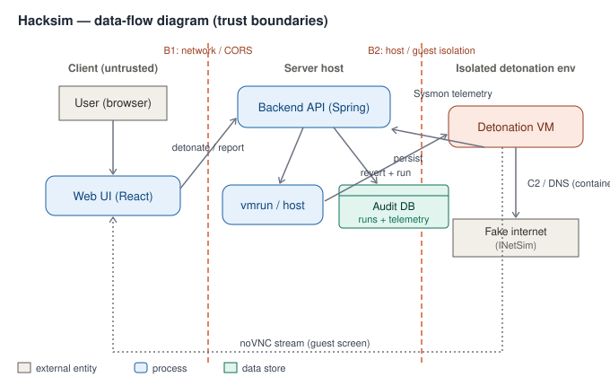

# Hacksim — malware-detonation & analysis sandbox

Hacksim teaches malware behaviour through a three-stage experience and turns the hands-on stage into a
small malware sandbox: learn about malware → experience a safe in-browser simulation → **detonate a
real sample in an isolated VM**, capture its behaviour, and read an ATT&CK-mapped report → check your
own machine with a posture self-diagnosis agent.

> Security note: this project executes real malware. It is meant to run only in the isolated lab
> described in [`network/`](network/) and [`docs/THREAT_MODEL.md`](docs/THREAT_MODEL.md). Do not point
> it at anything you care about.

## Architecture



| Tier | Tech | Role |
|------|------|------|
| Frontend | React + Tailwind | learning content, safe simulation, analysis dashboard, self-diagnosis |
| Backend | Spring Boot 4, Java 17, JPA/H2 | detonation orchestration, audit log, telemetry ingest + ATT&CK mapping, posture API |
| Detonation guest | VMware Fusion (Windows) + Sysmon | where the sample runs; behaviour shipped to the backend |
| Fake-net | INetSim | answers C2/DNS locally so there is no real egress |
| noVNC | Docker | streams the guest screen to the browser |

The detonation flow: `POST /api/start-simulation/{type}` (API-key guarded) → revert guest to a clean
snapshot → run the sample on a background worker (202 returned immediately) → Sysmon telemetry is
shipped back → backend classifies each behaviour to MITRE ATT&CK → report on the dashboard.

## Repository layout

```
backend/          Spring Boot API (detonation, telemetry, ATT&CK, posture, audit)
frontend/         React app (simulation, /dashboard, self-diagnosis)
vm_scripts/       Sysmon config, telemetry shipper, isolation-verification
diagnostic_agent/ endpoint posture self-assessment agent (8 CIS-style checks)
network/          isolated-lab topology + INetSim sink config
novnc_docker/     vendored noVNC for guest streaming
docs/             THREAT_MODEL.md (STRIDE + DFD), openapi.yaml
```

## Running it

### Web / analysis tier (Docker Compose)

```bash
docker compose up --build
# frontend  -> http://localhost:3000
# backend   -> http://localhost:5001
```

This runs everything except detonation (a container can't reach the host's VMware Fusion). The
dashboard, telemetry ingest, reports, and posture all work; `VMWARE_REVERT_BEFORE_RUN=false` here.

### Full detonation (on the host)

Detonation needs host-level `vmrun`, so run the backend on the host instead of in a container:

```bash
cd backend && HACKSIM_API_KEY=... VMWARE_GUEST_PASSWORD=... ./gradlew bootRun
```

Prerequisites: VMware Fusion with a guest snapshot named `clean` (logged in), Sysmon installed from
[`vm_scripts/`](vm_scripts/), and the isolated network from [`network/`](network/).

## Security

- API key (`X-API-Key`) required on the detonation trigger; rejects are audit-logged.
- Every detonation persisted (non-repudiation); behaviour mapped to MITRE ATT&CK server-side.
- Snapshot auto-revert + network isolation contain the sample; `vm_scripts/verify_isolation.ps1`
  gates the baseline snapshot.
- CI (`.github/workflows/ci.yml`) runs build/tests, `npm audit`, Semgrep SAST, and Trivy.
- Full analysis: [`docs/THREAT_MODEL.md`](docs/THREAT_MODEL.md). API: [`docs/openapi.yaml`](docs/openapi.yaml).

## Testing

```bash
cd backend && ./gradlew test     # unit (ATT&CK classifier) + MockMvc integration + auth
```
